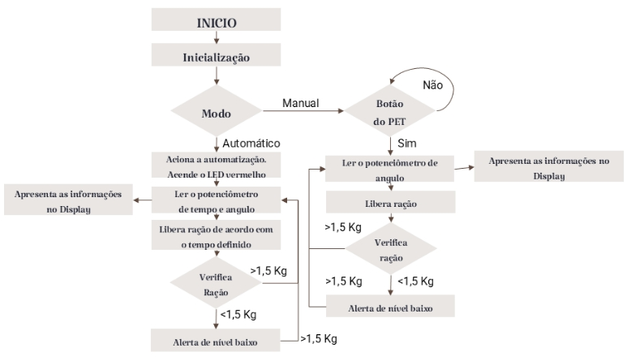

**O projeto foi desenvolvido por Ariadne Silva, Arthur Queiroz e César Miranda**

# ComedouroPet
O projeto visa desenvolver um sistema de automação de alimentação para animais domésticos utilizando um controlador **ATmega328** com linguagem **C**. O acesso aos pinos será realizado diretamente por meio de **registradores**, garantindo maior controle sobre as operações do microcontrolador.

Com base nos requisitos estabelecidos, o sistema será simulado no ambiente **Tinkercad**, permitindo a observação do funcionamento. A abordagem busca compreender a interação entre **sensores**, **atuadores** e **registradores**, analisando seu comportamento e eficiência na automação da alimentação.

Além disso, o projeto explora conceitos como:

- Conversão **A/D**
- Uso de **interrupções**
- Controle por **PWM**
- Interface com o **usuário**

Com isso, pretende-se oferecer uma solução prática e eficiente para os **tutores** e promover o **bem-estar dos animais**.

<p align="center">
  <br>
</p>

## 1. INTRODUÇÃO

Com o avanço da tecnologia e sua crescente integração à internet e aos objetos do nosso cotidiano, torna-se cada vez mais difícil imaginar um mundo sem soluções inteligentes. Nesse cenário, os sistemas embarcados têm desempenhado um papel fundamental ao viabilizar automações e mecanismos que executam tarefas do dia a dia com maior eficiência. Pensando nisso, este relatório apresenta o desenvolvimento de uma solução aplicada a um sistema embarcado voltado para o controle automatizado da alimentação de animais domésticos. A implementação foi realizada na plataforma Tinkercad, utilizando o microcontrolador ATmega328.

O projeto foi concebido para oferecer uma solução prática tanto automatizada quanto manual, voltada a tutores que nem sempre conseguem dedicar a atenção necessária aos seus pets. O sistema conta com um mecanismo de liberação de ração controlado por tempo e ângulo, além de realizar a supervisão contínua do nível de alimento disponível. Para isso, foram integrados sensores analógicos e digitais, atuadores com controle PWM e uma interface de interação com o usuário por meio de um display LCD. A robustez da aplicação é garantida por uma máquina de estados bem estruturada e pelo uso de interrupções via Timer1, assegurando monitoramento periódico e resposta imediata a situações críticas.

A programação do sistema foi desenvolvida em linguagem C pura pensando na programação do arduino Uno, ele teve acesso direto aos registradores do microcontrolador, o que permitiu um maior controle sobre os periféricos e a lógica de operação. Além disso, neste relatório, iremos detalhar os requisitos técnicos, a escolha dos componentes, a estrutura de funcionamento e os resultados obtidos com a simulação do sistema.

## 2. DESENVOLVIMENTO

### 2.1 Requisitos Técnicos

- Sensores: 
2 sensores analógicos com conversão A/D (potenciômetros); 
2 sensores digitais (interruptor e botão) Atuadores: 1 atuador digital (LED); 
1 atuador PWM (servo motor simulado).

- Interface com usuário: Display LCD (16x2 via I2C);
sinal sonoro ou visual (LEDs).

- Outros requisitos: Uso obrigatório de interrupção (Timer1) Código escrito em C puro. Implementação no Tinkercad com manipulação de registradores.

Para a realização do trabalho e atendimento aos requisitos previamente estabelecidos, foi montado um protótipo funcional do comedouro automático para pets. O sistema foi estruturado com base em componentes essenciais, cada um responsável por desempenhar funções específicas dentro da lógica de controle automatizado e seguro da liberação de ração, com verificação periódica do nível de alimento e sinalização de alertas em casos críticos.

A tabela a seguir apresenta os principais componentes utilizados no projeto, acompanhados de suas respectivas quantidades e observações sobre sua aplicação no sistema:

<div align="center">
Tabela 01 - Componentes do circuito

| Componentes                        | Quantidade | Observações                           |
|-----------------------------------|------------|----------------------------------------|
| Arduino Uno R3                    | 1          | Microcontrolador principal             |
| Potenciômetros                    | 3          | Controle de tempo, ângulo e nível      |
| Interruptor deslizante            | 1          | Modo ON/OFF                            |
| Botão                             | 1          | Ação manual do sistema                 |
| Resistores diversos               | 5          | 220Ω, 100Ω, 10kΩ                        |
| LEDs (vermelho, verde e laranja) | 2          | Indicação visual de estado             |
| Osciloscópio virtual              | 1          | Para verificação de sinal PWM          |
| Display LCD (I2C 0x27)            | 1          | Interface de exibição de informações   |

**Fonte:** Elaborada pelos autores.
</div>

### 2.2 Montagem do circuito

A figura abaixo ilustra a montagem física do circuito no simulador Tinkercad, utilizando a placa Arduino Uno R3 como núcleo de controle. O sistema foi desenvolvido para atender aos requisitos de automação de um comedouro para animais de estimação, integrando sensores, atuadores e interface de usuário.

<p align="center">
  <br>
  <strong>Figura 01</strong> - Montagem do circuito no simulador Tinkercad<br>
  <em>Fonte: www.tinkercad.com</em>
</p>

<p align="center">
  <br>
  <strong>Figura 02</strong> - Visão Esquemática<br>
  <em>Fonte: www.tinkercad.com</em>
</p>

A montagem do circuito foi realizada na plataforma Tinkercad e teve como base o microcontrolador Arduino Uno R3, responsável por gerenciar a leitura dos sensores, o acionamento dos atuadores e toda a lógica de funcionamento do sistema. Foram utilizados três potenciômetros conectados aos pinos A0, A1 e A2, com funções distintas: um para o controle do tempo de liberação da ração, outro para a definição do ângulo do servo motor (simulado) e o terceiro para simular o nível de ração disponível no reservatório, funcionando como um sensor analógico. O sistema conta também com três LEDs indicadores, sendo um vermelho, que indica o modo de funcionamento do sistema (manual ou automático), verde, que simula o funcionamento do servo motor por meio do controle de intensidade da luz que é acionado via controle PWM, e outro laranja, que permanece aceso quando o nível de ração está abaixo do valor crítico. Esses LEDs estão conectados aos pinos digitais PD3, PD6 e PD7, respectivamente, ambos com resistores de em série, garantindo proteção aos componentes. Para permitir o acionamento do sistema quando estiver manual, foi inserido um botão, conectado ao pino PD2. Esse botão permite que o pet acione a liberação de ração mesmo fora do modo automático. Já o interruptor deslizante, conectado ao pino PD5, é responsável por alternar entre os modos de operação, permitindo que o sistema funcione de forma automática ou manual, conforme a necessidade. Como interface de comunicação com o usuário, foi utilizado um display LCD 16x2 com a biblioteca I2C, cujo endereço padrão é 0x27. Suas conexões seguem o padrão GND para GND do Arduino, VCC para 5V, SDA para o pino A4 e SCL para o pino A5. A função desse componente é exibir informações como o intervalo de tempo que ocorreria a liberação,  o ângulo de abertura para liberação e mensagens de status importantes, como alertas de nível crítico de ração ou sistema pausado. Por fim, embora não tenha uma função ativa no funcionamento do sistema, o osciloscópio virtual do Tinkercad foi conectado à saída PWM como recurso de apoio à simulação. Ele serviu para verificar a intensidade do sinal gerado e garantir que o controle PWM estivesse operando corretamente, simulando de forma eficaz o comportamento de um servo motor.

### 2.1 Funcionamento do circuito

Para um melhor entendimento, criamos um fluxograma que ilustra o funcionamento lógico do sistema embarcado desenvolvido para o comedouro automatizado.

<p align="center">
  <br>
  <strong>Figura 03</strong> - Fluxograma do processo de funcionamento<br>
  <em>Fonte: Elaborado pelos autores.</em>
</p>

O processo inicia com a etapa de inicialização do sistema, onde são configurados os registradores do microcontrolador, os sensores e o display. Em seguida, o sistema verifica qual modo de operação foi selecionado: automático ou manual, por meio da posição do interruptor deslizante. 

Se o modo automático estiver ativado, o sistema aciona o processo de automação e acende o LED vermelho como indicação visual. Em seguida, realiza a leitura dos potenciômetros de tempo e ângulo, e com base nesses valores, libera a ração conforme o tempo configurado pelo usuário, com todas essas informações de ângulo e tempo sendo possíveis serem visualizadas no display utilizado. Após a liberação, o sistema verifica o nível de ração disponível por meio do sensor analógico simulado, essa verificação é feita de tempos em tempos. Caso o valor esteja acima de 1,5 kg - valor que foi configurado para o nosso teste, mas que pode ser outro caso o usuário prefira - o sistema mantém o funcionamento normal. No entanto, se o nível estiver abaixo de 1,5 kg, o sistema ativa o modo de alerta, exibindo uma mensagem no display e mantendo o LED laranja aceso, sinalizando o nível crítico de ração.

No caso do modo manual, o sistema aguarda que o botão do PET seja pressionado. Se isso não ocorrer, ele permanece em espera. Ao pressionar o botão, o sistema realiza a leitura do potenciômetro de ângulo, libera a ração com base nesse valor e, da mesma forma que no modo automático, verifica o nível da ração. Se o nível estiver adequado, o processo segue normalmente. Caso contrário, o sistema também emite um alerta de nível baixo.

Durante ambos os modos, o display LCD desempenha papel fundamental ao apresentar informações como tempo de liberação, ângulo de abertura e mensagens de status, garantindo uma comunicação clara com o usuário e maior controle sobre o funcionamento do dispositivo.

### 2.4 Codificação utilizando a linguagem de programação C

Abaixo, mostraremos como o código-fonte foi desenvolvido em linguagem C pura, estruturado para ser executado diretamente no microcontrolador ATmega328 do Arduino Uno. O código implementa toda a lógica do sistema embarcado, incluindo a inicialização dos periféricos, configuração dos temporizadores, leitura dos sensores analógicos, acionamento dos atuadores por meio de PWM, atualização da interface via display LCD e o gerenciamento de estados do sistema. Além disso, com o uso de interrupções permite a verificação periódica do nível de ração de forma eficiente, garantindo uma resposta imediata em situações críticas. A organização do código em uma máquina de estados (NORMAL, VERIFICANDO e PAUSADO) assegura clareza, modularidade e robustez no controle do sistema como um todo.

As bibliotecas “Wire.h” e “LiquidCrystal_I2C.h” foram utilizadas para estabelecer a comunicação com o display LCD por meio do protocolo I2C, permitindo o controle do display com apenas dois fios, o que simplifica o hardware e facilita a escrita dos comandos. A comunicação com o display ocorre em blocos de 8 bits, graças ao uso de um expansor de I/O típico desse tipo de módulo. Para o controle de brilho do LED via PWM, utilizam-se registradores de 8 bits, com valores que variam de 0 a 255 — como na variável **intensidadeLED**. As portas digitais do microcontrolador também são manipuladas por registradores de 8 bits, onde cada bit representa um pino. As leituras dos sensores analógicos utilizam o conversor analógico-digital (ADC) com resolução de 10 bits, e os resultados são armazenados em variáveis de 16 bits **(uint16_t)** para garantir compatibilidade. Já os temporizadores, utilizados para o controle de tempo com millis(), trabalham com variáveis de 32 bits, como **tempoPausaMsg**, **ledVerdeInicio** e **ultimoAcionamento**, permitindo o gerenciamento preciso de eventos no tempo. (Esses trechos do código estão distribuídos nas imagens 1 e 2, que abrangem as linhas de 1 a 93.)

### Código-fonte em linguagem C

```c
1   #include &lt;LiquidCrystal_I2C.h&gt;
2   #include &lt;Wire.h&gt;
3   
4   LiquidCrystal_I2C lcd(0x27, 16, 2);
5   
6   enum EstadoSistema { NORMAL, VERIFICANDO, PAUSADO };
7   
8   volatile bool flagVerificaRacao = false; //Sinaliza quando deve verificar a ração
9   EstadoSistema estadoSistema = NORMAL; 
10  
11  unsigned long tempoPausaMsg = 0; //controlam o tempo da mensagem no display
12  const unsigned long tempoMsg = 2000;
13  
14  bool estadoBotaoAnterior = false; //armazena a intensidade do led
15  unsigned long ledVerdeInicio = 0;
16  bool ledVerdeAtivo = false;
17  uint8_t intensidadeLED = 0;
18  
19  unsigned long ultimoAcionamento = 0;
20  unsigned long ultimoTempo = 0;
21  int ultimoAngulo = -1;
22  
23  void adc_init() {  // inicializa a conversão do sinal Ana --> Digi
24    ADCSRA = (1 &lt;&lt; ADEN) | (1 &lt;&lt; ADPS2) | (1 &lt;&lt; ADPS1);
25  }
26  
27  uint16_t ler_adc(uint8_t canal) {
28    ADMUX = (1 &lt;&lt; REFS0) | (canal &amp; 0x0F);
29    ADCSRA |= (1 &lt;&lt; ADSC);
30    while (ADCSRA &amp; (1 &lt;&lt; ADSC));
31    return ADC;
32  }
33  
34  uint16_t ler_racao() {
35    uint16_t valor_adc = ler_adc(2);
36    return map(valor_adc, 0, 1023, 0, 10000);
37  }
38  
39  void moverServoComLED(int angulo) {
40    OCR0A = 0;  
41    intensidadeLED = map(angulo, 0, 180, 50, 255);
42    OCR0A = intensidadeLED;
43    ledVerdeAtivo = true;
44    ledVerdeInicio = millis();
45  }
46  
47  ISR(TIMER1_COMPA_vect) {
48    flagVerificaRacao = true;
49  }
50  
51  void setup() {
52    lcd.init();
53    lcd.backlight();
54    lcd.setCursor(0, 0);
55    lcd.print("Sistema Pet");
56    delay(4000);
57  
58    adc_init();
59  
60    DDRD |= (1 &lt;&lt; PD6);   
61    DDRD |= (1 &lt;&lt; PD7);   
62    DDRD |= (1 &lt;&lt; PD3);   
63    DDRD &amp;= ~(1 &lt;&lt; PD2);  
64    DDRD &amp;= ~(1 &lt;&lt; PD5);  
65  
66    TCCR0A = (1 &lt;&lt; COM0A1) | (1 &lt;&lt; WGM01) | (1 &lt;&lt; WGM00);
67    TCCR0B = (1 &lt;&lt; CS01);
68  
69    cli();
70    TCCR1A = 0;
71    TCCR1B = (1 &lt;&lt; WGM12) | (1 &lt;&lt; CS12) | (1 &lt;&lt; CS10);
72    OCR1A = 15624 * 5;
73    TIMSK1 |= (1 &lt;&lt; OCIE1A);
74    sei();
75  }
76  
77  void loop() {
78    unsigned long agora = millis();
79  
80    switch (estadoSistema) {
81      case VERIFICANDO: {
82        PORTD |= (1 &lt;&lt; PD7);
83        uint16_t racao = ler_racao();
84        if (racao &lt; 1500) {
85          lcd.clear();
86          lcd.setCursor(0, 0);
87          lcd.print("Pouca racao!");
88          lcd.setCursor(0, 1);
89          lcd.print("PAUSADO");
90          OCR0A = 0;
91          ledVerdeAtivo = false;
92          estadoSistema = PAUSADO;
93        } else {
94          PORTD &amp;= ~(1 &lt;&lt; PD7);
95          estadoSistema = NORMAL;
96        }
97        flagVerificaRacao = false;
98        break;
99      }
100 
101     case PAUSADO: {
102       PORTD |= (1 &lt;&lt; PD7);
103       lcd.setCursor(0, 0);
104       lcd.print("Sistema PAUSADO");
105       lcd.setCursor(0, 1);
106       lcd.print("Pouca racao!");
107       uint16_t racao = ler_racao();
108       if (racao &gt;= 1500) {
109         estadoSistema = NORMAL;
110         PORTD &amp;= ~(1 &lt;&lt; PD7);
111         lcd.clear();
112         lcd.setCursor(0, 0);
113         lcd.print("Reabastecido!");
114         tempoPausaMsg = agora + tempoMsg;
115       }
116       break;
117     }
118 
119     case NORMAL: {
120       if (flagVerificaRacao) {
121         estadoSistema = VERIFICANDO;
122         break;
123       }
124       if (tempoPausaMsg != 0 &amp;&amp; agora &gt; tempoPausaMsg) {
125         lcd.clear();
126         tempoPausaMsg = 0;
127       }
128       if (ledVerdeAtivo &amp;&amp; (agora - ledVerdeInicio &gt;= 2000)) {
129         OCR0A = 0;  
130         ledVerdeAtivo = false;
131       }
132       uint16_t ang_adc = ler_adc(1);
133       int angulo = map(ang_adc, 0, 1023, 0, 180);
134       uint16_t tempo_adc = ler_adc(0);
135       unsigned long intervalo_ms = map(tempo_adc, 0, 1023, 0, 10000);
136       bool modoAutomatico = (PIND &amp; (1 &lt;&lt; PD5));
137       bool estadoAtual = (PIND &amp; (1 &lt;&lt; PD2));
138       if (modoAutomatico) {
139         PORTD |= (1 &lt;&lt; PD3);
140       } else {
141         PORTD &amp;= ~(1 &lt;&lt; PD3);
142       }
143       if (angulo != ultimoAngulo || intervalo_ms != ultimoTempo) {
144         lcd.clear();
145         lcd.setCursor(0, 0);
146         lcd.print("Ang:");
147         lcd.print(angulo);
148         if (modoAutomatico) {
149           lcd.setCursor(0, 1);
150           lcd.print("T:");
151           lcd.print(intervalo_ms / 1000.0, 1);
152           lcd.print(" s");
153         }
154         ultimoAngulo = angulo;
155         ultimoTempo = intervalo_ms;
156       }
157       if (!modoAutomatico) {
158         if (estadoAtual &amp;&amp; !estadoBotaoAnterior) {
159           moverServoComLED(angulo);
160         }
161       } else {
162         if (agora - ultimoAcionamento &gt;= intervalo_ms) {
163           moverServoComLED(angulo);
164           ultimoAcionamento = agora;
165         }
166       }
167       estadoBotaoAnterior = estadoAtual;
168       break;
169     }
170   }
171 }
```

## 3. RESULTADOS ESPERADOS

<p align="center">
  <br>
  <strong>Figura 04</strong> - Simulação do funcionamento no Tinkercad<br>
  <em>Fonte: www.tinkercad.com</em>
</p>

Com base nas simulações realizadas, no modo manual, o LED vermelho permanecerá apagado para indicar esse modo, enquanto o servo motor, representado pelo LED verde, será ativado apenas quando houver interação com o botão do pet. A intensidade da luz emitida pelo LED verde simula o ângulo de abertura: quanto menor o ângulo, menor o brilho; quanto maior o ângulo, maior o brilho. Após qualquer alteração, a informação de abertura será exibida no LCD.

No modo automático, o LED vermelho será acionado, e o funcionamento seguirá os parâmetros de ângulo e tempo. O tempo indica o período em que ocorrerá a liberação de ração, enquanto o ângulo determina a quantidade a ser dispensada. As informações serão apresentadas no LCD sempre que houver alterações. Assim como no modo manual, o LED verde será acionado conforme o ângulo pré-definido.

Em ambas as situações, o sistema realizará verificações periódicas do nível de ração no armazenamento. Durante essas verificações, todo o funcionamento será interrompido para analisar a quantidade disponível. Caso o alimento seja insuficiente, o sistema emitirá um alerta por meio do LCD e acenderá o LED laranja, entrando em estado de pausa até que haja ração suficiente. Assim que o armazenamento for abastecido, o funcionamento será retomado normalmente.

Durante o processo de simulação ele se comportou conforme o esperado, porém apresentou lentidão na escrita no display após ciclos de testes muito longos.

## 4. CONCLUSÃO E CONSIDERAÇÕES FINAIS

Através da realização deste projeto, foi possível pôr em prática a teoria de conceitos essenciais vistos em sala de aula e laboratório, como a conversão analógico-digital para a leitura de sensores, modulação por largura de pulso para a simulação de atuadores e o uso de interrupção para tarefas periódicas.

O ambiente de simulação Tinkercad apesar de ter demonstrado algumas limitações, sendo necessário aplicar modificações no projeto para simular os componentes indispensáveis, permitiu validar o ciclo completo do projeto, desde a montagem do circuito até a depuração do código, resultando em um protótipo que operou conforme o esperado e demonstrou a viabilidade da solução proposta.

<p align="center">
  <br>
</p>

## 5. ANEXOS
Anexo com link para o projeto no Tinkercad :

<p align="center">
  <br>
  <strong>Figura 05</strong> - QR code com o link do projeto<br>
  <em>Fonte: www.canva.com</em>
</p>

Vídeos de Simulação: 
 - Simulação Manual.mp4

## Demonstração do Projeto

- Simulação Manual.mp4
<p align="center">
  <a href="https://youtu.be/NX8mIZvv0_s" target="_blank">
    
  </a>
</p>


 - Simulação Automática.mp4
<p align="center">
  <a href="https://youtu.be/idfrjFR6aVM" target="_blank">
    
  </a>
</p>
